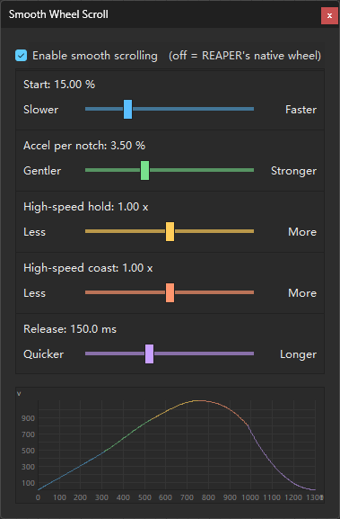

# Smooth Wheel Scroll for REAPER

[](LICENSE)


A native REAPER extension that smooths wheel-driven scrolling and zooming —
**without changing what the wheel does**.

[中文说明](README.md)

<p align="center">
  
</p>

REAPER already has a wheel-driven action for almost everything you would scroll or zoom
(their names contain `(MIDI CC relative/mousewheel)`), and those actions already accept a
smooth relative amount. This plugin intercepts one notch of a plain mouse wheel, turns it
into an animation, and feeds the result to the **same REAPER action** in small pieces over
time.

The plugin never moves a view or changes REAPER state. Zoom anchoring, scroll ranges, step
sizes and user-customized rules all stay as REAPER defines them.

---

## What is smoothed

| Surface | How |
|---|---|
| Main arrange view: scroll + zoom | REAPER's own actions |
| The arrange view's two scrollbars | Vertical bar scrolls; `Alt`+wheel zooms vertically. Horizontal bar: `Alt`+wheel zooms horizontally (the no-`Alt` paging-style pan is not taken over) |
| MIDI editor: scroll + zoom | the MIDI editor section's own actions |
| Track control panel (TCP) | follows your Mouse Modifier: default `Scroll TCP` → vertical scroll; `Adjust vertical zoom` → vertical zoom |
| MIDI editor piano keys | vertical scroll |
| Mixer panel (MCP) | horizontal scroll |
| Every action whose name contains `mousewheel` | matched **by action name**, so custom or re-bound keys work too |

Scrollbars are found by geometry; the track and mixer panels by their **Mouse Modifier**
(`Scroll TCP` / `Scroll MCP`). Reassign one of those combinations (say to `Passthrough`) and
the plugin passes it through.

## What is deliberately left alone

* **Parameter-type wheels.** Faders, knobs, tempo, send amounts, MIDI note velocity,
  dropdowns and the like are passed through untouched, so they still move in exact single
  steps.
* **Lists.** List/tree controls move in whole rows and REAPER's native response is already
  instant, so animating them could only add latency.
* **Touchpads, touch, high-resolution/free-spinning wheels, pen.** Only a plain notched mouse
  wheel is handled (a whole `WHEEL_DELTA` multiple, not touch-injected).

---

## Install

Windows x64, REAPER 7.

1. Download `reaper_smoothwheelscroll-x64.dll` from [Releases](../../releases).
2. Put it in `UserPlugins`: portable `<REAPER>/UserPlugins/`, normal install
   `%APPDATA%\REAPER\UserPlugins\`.
3. Restart REAPER.

Once loaded it appears as `Smooth Wheel Scroll 1.7.0` in the Extensions list and the startup log.

### Settings panel

Open it either way:

1. **Extensions menu** → `SmoothScroll...`
2. **Actions window**: search for `Smooth Wheel Scroll` and use
   `Smooth Wheel Scroll: settings...`; it can be bound to a key, and pressing that key again
   closes the panel.

The panel holds a master smoothing switch, four sliders, and a **motion chart** under them.
Changes apply live and are saved automatically.

* **Glide length** — how long one notch's animation takes (100–300 ms, default **200**).
* **Slow step** — how far a slow notch moves, in deltas (1–10, default **5**).
* **Ramp-up** — how much turning it takes to reach a full notch (60–2000, default **1000**).
* **Top speed** — how far past the wheel's own speed the fastest rolls may climb
  (1.0–2.0x, default **1.5**).
* **The motion chart** runs a scripted roll and draws the wheel's own stepped path (dashed grey)
  against the smooth path the plugin hands over (coloured per slider), with **one ball running
  along it**. **Every received wheel message launches a ball** (up to six in flight). With the
  master switch off the ball still runs — along the stepped path — so the switch's effect is
  visible at a glance. Each of the four sliders owns one visual channel: Glide the time axis,
  Slow step the knee's height, Ramp-up the slope, Top speed the vertical scale (the native
  reference sits at `1/Top`, so at `Top = 1.0` the flat top rests exactly on it). The tick numbers
  are taken from the real values, so they rescale as Glide and Top move.
* The panel follows REAPER's light/dark state: caption, panel colour, text and scrollbar.
* Turning the master switch off passes the wheel through untouched.

<p align="center">
  
</p>

### Uninstall

Delete the DLL and restart REAPER. Apart from the panel's parameters it writes no configuration.

---

## Build from source

One translation unit plus a few headers, built with a C++17 compiler against the REAPER SDK
vendored in `third_party/`. The reference build uses a portable MinGW-w64 toolchain.

```sh
./build.sh        # release DLL -> build/reaper_smoothwheelscroll-x64.dll
./deploy.sh       # optional: copy it into REAPER's UserPlugins
```

Build flags:

| Flag | Effect |
|---|---|
| *(none)* | includes the settings panel (default) |
| `--no-settings-ui` | compiles the settings panel out |
| `--debug-log` | adds diagnostic logging to `%TEMP%\SmoothWheelScroll.log` |

Regression gates (run standalone, no REAPER needed):

```sh
./test/check_anim3.sh          # window model: equal parts, exact total, frame-rate independent, overlaps add
./test/check_conservation.sh   # take N, give N -- exactly
./test/check_travel.sh         # travel from the speed budget, device-independent
./test/check_device.sh         # notched / free-spinning / touchpad separation
./test/check_routes.sh         # routing against the frozen baseline, line by line
./test/check_classify.sh       # classification rules, before/after (only "one page" may differ)
./test/check_filter.sh         # the filter's delivery granularity per axis
```

---

## Code layout

| File | What it is |
|---|---|
| `src/anim3_core.h` | the 3.0 model: windows / payout shape (pure math, no REAPER, no Windows) |
| `src/anim161_core.h` | the 1.6.1 curve model (vertical zoom only; byte-identical to 1.6.1) |
| `src/model.h` | the model seam: the one entry point to the models |
| `src/routing.h` | delivery routing: which action, at what granularity |
| `src/device.h` | device classification (notched / free-spinning / touchpad) |
| `src/smooth_wheel_scroll.cpp` | the REAPER extension: classify, feed, deliver, settings panel |
| `test/` | the regression gates |
| `versions/<ver>/` | frozen snapshots per release |
| `third_party/` | the REAPER extension SDK |

---

## Limitations

* Windows x64 only; macOS and Linux would each need their own window-hook implementation.
* Plain notched mouse wheels only. On a device that already smooths, you may feel both.

---

## License

MIT — see [LICENSE](LICENSE). The REAPER extension SDK in `third_party/` carries its own license.
