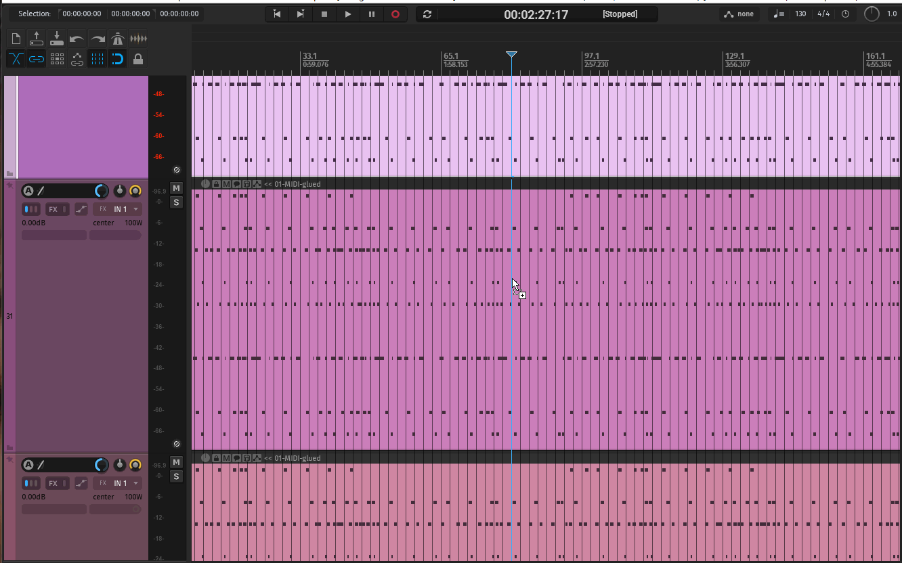

# Smooth Wheel Scroll for REAPER

[](LICENSE)


A native REAPER extension that turns the mouse wheel into the kind of fine-grained,
inertial scrolling a touchpad produces — **without changing what the wheel does**.

[中文说明](README.md)

<p align="center">
  
</p>

REAPER already ships a wheel-driven action for almost everything you would want to
scroll or zoom (its action names end in `(MIDI CC relative/mousewheel)`). Those
actions already accept a smooth relative amount. The problem is the *mouse*: one
notch is one large `WHEEL_DELTA` step, so the same action receives one coarse jump
per notch and the motion looks steppy. This plugin intercepts the wheel, runs the
notch through a small physical model, and feeds the resulting travel to the **same
REAPER action**, in small pieces, over time.

The result is the feel of a high-resolution trackpad driven by a normal, notched
wheel.

---

## How it works (the one job)

The plugin does exactly one thing:

> Turn the mouse wheel's parameter into a more elegant reference animation and hand
> it to the receiver — whatever the receiver is.

Everything it drives is delivered by **REAPER's own actions**. The plugin never moves
a view or changes REAPER state itself; it finds the matching action and gives it the
animated relative value. Zoom anchoring, scroll ranges, user-customized rules and
step sizes therefore stay exactly as REAPER defines them.

```
notched wheel ──► this plugin ──► the SAME REAPER action, in small pieces over time
   (1 x 120)        (model)              (View: Scroll/Zoom ... mousewheel)
```

### What is smoothed

| Surface | How |
|---|---|
| Main arrange view: scroll + zoom | REAPER's own actions, replayed with the animated value |
| MIDI editor: scroll + zoom | the MIDI editor section's own actions |
| Every action whose name ends in `mousewheel` | same path (matched **by action name**, so custom/re-bound keys follow automatically) |
| Track control panel (TCP) body | the same vertical-scroll action the arrange uses |
| MIDI editor piano keys | the MIDI editor's vertical-scroll action |
| The two width-drag dividers beside the track panel | the half against the panel scrolls tracks; the outer half is left to REAPER (it is the main view there) |

### What is deliberately left alone

* **Parameter-type wheels.** Anything that *changes a value* under the wheel —
  faders, knobs, tempo, send amounts, MIDI note velocity, dropdowns — is passed
  through untouched, so it still moves in exact single steps. This is not a hand-made
  blocklist: a parameter is either reported by REAPER as a non-`View` action, or it
  produces no action at all and changes its value internally. Either way it never
  enters the animation.
* **Lists.** List/tree controls move in whole rows and REAPER's native response is
  already instant, so animating them could only add latency. They are passed
  through. (This was tried and rejected with measurements — see
  [§ Design notes](#design-notes).)
* **Touchpads, high-resolution/free-spinning wheels, touch and pen.** The plugin
  only ever changes a *plain notched mouse wheel* (a whole `WHEEL_DELTA` multiple,
  not touch-injected). Everything else is already fine-grained and is left to
  REAPER.

---

## Install

Windows x64, REAPER 7 (built and tested against `7.79`).

1. Download `reaper_smoothwheelscroll-x64.dll` from
   [Releases](../../releases).
2. Put it in REAPER's `UserPlugins` folder:
   * **Portable install:** `<REAPER>/UserPlugins/`
   * **Normal install:** `%APPDATA%\REAPER\UserPlugins\`
3. Restart REAPER.

That is the whole install. There is **no settings dialog and nothing to
configure** — the plugin runs the tuned defaults and is active immediately.

To verify it loaded, check the Extensions list or REAPER's startup log; the plugin
also appears as `Smooth Wheel Scroll 1.3.7`.

### Uninstall

Delete the DLL and restart REAPER. No configuration is written anywhere, so nothing
is left behind.

---

## Build from source

The code is a single translation unit plus one header, built with a C++
compiler against the REAPER extension SDK (vendored in `third_party/`).

Requirements: a C++17 compiler for Windows x64. The reference build uses a portable
MinGW-w64 (g++) toolchain.

```sh
./build.sh                 # release DLL -> build/reaper_smoothwheelscroll-x64.dll
./deploy.sh                # copy it into a portable REAPER's UserPlugins (optional)
```

Optional build flags:

| Flag | Effect |
|---|---|
| *(none)* | release build; contains the plugin and nothing else |
| `--tuning-ui` | also compiles the author's tuning window and its Extensions-menu entry |
| `--debug-log` | compiles diagnostic logging to `%TEMP%\SmoothWheelScroll.log` |

`deploy.sh` refuses to run while REAPER has the DLL loaded, and it reads
`REAPER_DIR` (default `/d/REAPER`).

### Verifying the animation model

The animation is pure math with no REAPER or Windows dependency, and lives in
`src/anim_core.h`. It is exercised standalone:

```sh
./test/check_v1_baseline.sh   # compares the model against the frozen 1.0.0 numbers
```

A single wheel notch must stay at **1.89** units with a peak velocity of **17.94**;
those are the accepted reference values, and the script reports `OK` or `DRIFT`.

---

## How it is put together

| File | What it is |
|---|---|
| `src/anim_core.h` | the animation itself — pure math, no REAPER, no Windows |
| `src/smooth_wheel_scroll.cpp` | the REAPER extension: classify, feed, deliver |
| `test/check_v1_baseline.sh` | regression gate against the frozen model |
| `versions/<ver>/` | frozen snapshots (source + DLL + `MODEL.md`) |
| `third_party/` | the REAPER extension SDK |
| `_diag/` | read-only measurement probes used while developing |

### The animation model

A wheel notch gives the view a **velocity impulse**; friction bleeds it off. Position
integrates velocity, so a notch starts from rest, accelerates, coasts and settles —
and notches arriving before the previous one has decayed add their impulses, so a
sustained roll builds speed.

* impulse grows per notch (`Start %` for the first, `+ Accel %` for each further one)
* a per-notch `smoothstep` onset (`S(u) = 3u² − 2u³`)
* power-law friction, `dv/dt = −c·v^p` with `p = 0.8`
* brake-by-rhythm: a faster roll loosens the brake, so a quick flick coasts further
* integrated on a fixed 0.25 ms grid, so the motion does not depend on the timer

The model is **frozen**: it was accepted by ear, and later work may only tune
parameters or the delivery around it, never restructure it. `anim_core.h` is
byte-identical to the accepted version in every release since.

### Delivery

The animated travel is handed to the action as REAPER's own **relative** value,
using its fine-grained encoding (an integer 7-bit part plus a `1/256` fractional
part, i.e. steps of `1/3840` of a notch). Values are delivered in small pieces over
time rather than as a few whole units, which is what makes slow motion smooth.

### Parameter delivery: do not second-guess the receiver

**This is the project's founding principle, fixed here. Any change must obey it:**

> The plugin's only job is to **deliver the parameter as well as it possibly can** —
> the highest precision available, the most elegant model achievable.
> **It does not consider the receiver's (REAPER's) own capability limits.**
> Whether the receiver can handle it, and how well, **is the receiver's business**;
> if it cannot, it will optimize itself.

Concretely:

* **Always give full precision.** The relative value uses REAPER's own encoding with
  its `1/256` fractional part, down to `1/3840` of a notch — never degraded to whole
  units.
* **Send whatever the animation computes**, fraction included.
* **Never reduce precision because "the receiver might not cope"**, and never add an
  artificial floor to the model or the delivery (things like "minimum N pixels" or
  "at least 1 unit before sending").
* **Never make the receiver's trade-offs for it**: do not exclude an action because
  you predict it "cannot take this much". If it should be bound, bind it, and send
  what should be sent.
* If the receiver handles it poorly, that is **not a defect of this plugin**, and it
  is not "fixed" by lowering the plugin's quality.

The plugin is responsible for parameter delivery, and for doing it as well as it can.

### The animation clock

Position sampling density matters as much as value precision. On the test machine
`SetTimer` and `CreateTimerQueueTimer` are both clamped to ~15.6 ms regardless of
the requested interval, which leaves too few samples. The plugin therefore uses a
multimedia timer (`timeSetEvent`) at 1 ms. Its callback runs on a timer thread,
where REAPER must not be called, so it only posts to a small message-only window the
plugin owns, and the UI thread does the work.

---

## Design notes

Some choices were settled by measurement, not preference. The results are kept here
so they do not have to be re-derived.

* **Parameter controls are never blocklisted.** Testing confirmed that a value
  change under the wheel either arrives as a non-`View` action (MIDI note velocity
  is action `999`) or produces no action at all while changing the value internally
  (a Preferences dropdown moved from one item to the next). Both classes are
  therefore safe by construction: the rule "if it is not a View scroll/zoom, do not
  touch it" covers them.
* **The same window can be both a view and a parameter.** In the MIDI editor's note
  area a plain wheel zooms the view, while `Alt`+wheel edits the selected notes'
  velocity — the window class is identical. Only the action REAPER reports tells
  them apart, which is why classification keys on the action, never on the window.
* **Lists were implemented, measured, and removed.** A list/tree control moves in
  whole rows and REAPER's native response is already instant, so a smoothed arrival
  can only add latency. The experiment is archived under `versions/1.4.0/`
  (not part of the release) with its measurements.

---

## Scope and limitations

* **Windows x64 only.** The plugin hooks Win32 window messages; macOS and Linux
  would each need their own window-hook implementation.
* **Plain notched mice only.** Touchpad, touch and high-resolution wheels are left
  to REAPER — they are already fine-grained, and the point of the plugin is to give
  a notched wheel that same refined signal.
* **No settings UI.** The tuned defaults are compiled in. The author's tuning
  window is kept in the source behind `--tuning-ui` for future model work.
* The plugin does **not** add inertia of its own on top of a driver that already
  provides it; if your device already smooths, you may feel both.

---

## License

MIT — see [LICENSE](LICENSE).

The vendored REAPER extension SDK in `third_party/` is covered by its own zlib-style
license; see `third_party/reaper-sdk-git/sdk/LICENSE`.
