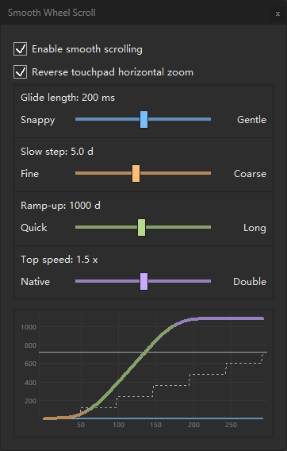
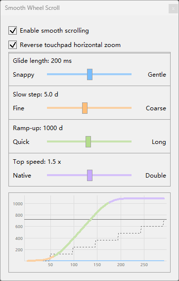

# Smooth Wheel Scroll for REAPER

[](LICENSE)


A native REAPER extension that turns wheel-driven scrolling and zooming into a smooth animation —
**without changing what the wheel does**.

[中文说明](README.md)

<p align="center">
  
</p>

The plugin intercepts one notch of the wheel, turns it into an animation, and feeds the result to the
**same REAPER action** in small pieces over time. It never moves a view or changes REAPER state: zoom
anchoring, scroll ranges, step sizes and user-customized rules all stay as REAPER defines them.

---

## What is smoothed

| Surface | How |
|---|---|
| Main arrange view: scroll + zoom | REAPER's own actions |
| The arrange view's two scrollbars | vertical bar scrolls; `Alt`+wheel zooms |
| MIDI editor: scroll + zoom | the MIDI editor section's own actions |
| Track control panel (TCP) | follows your Mouse Modifier (`Scroll TCP` / `Adjust vertical zoom`) |
| MIDI editor piano keys | vertical scroll |
| Mixer panel (MCP) | horizontal scroll |
| Actions whose name contains `mousewheel` | matched **by action name**, so custom or re-bound keys work too |
| Custom actions (`Custom:`) | a macro built from the above is smoothed as a whole |

## Left alone

* **Parameter-type wheels** — faders, knobs, tempo, send amounts, note velocity, dropdowns.
* **Lists** — whole-row movement, already instant natively.
* **Touchpads, touch, pen** — passed to REAPER untouched.

---

## Install

Windows x64, REAPER 7.

1. Download `reaper_smoothwheelscroll-x64.dll` from [Releases](../../releases).
2. Put it in `UserPlugins`: portable `<REAPER>/UserPlugins/`, normal install
   `%APPDATA%\REAPER\UserPlugins\`.
3. Restart REAPER.

Once loaded it appears as `Smooth Wheel Scroll 1.7.1`.

### Settings panel

**Extensions menu** → `SmoothScroll...`; or in the **Actions window** use
`Smooth Wheel Scroll: settings...` (bindable to a key; press again to close). Changes apply live and
are saved automatically.

* **Glide length** — how long one notch's animation takes (100–300 ms, default 200)
* **Slow step** — how far a slow notch moves (1–10 delta, default 5)
* **Ramp-up** — how much turning before a notch reaches full size (60–2000 delta, default 1000)
* **Top speed** — how far past the wheel's own speed the fastest rolls may climb (1.0–2.0x, default 1.5)
* **Master switch** — off passes the wheel through untouched

Below the sliders is a **motion chart**: every received wheel message launches a ball along the path,
showing what the current settings do.

<p align="center">
  
  &nbsp;&nbsp;
  
</p>

### Uninstall

Delete the DLL and restart REAPER.

---

## Build from source

A C++17 compiler against the REAPER SDK vendored in `third_party/`. The reference build uses a
portable MinGW-w64 toolchain.

```sh
./build.sh        # -> build/reaper_smoothwheelscroll-x64.dll
./deploy.sh       # optional: copy it into UserPlugins
```

| Flag | Effect |
|---|---|
| *(none)* | includes the settings panel (default) |
| `--no-settings-ui` | compiles the settings panel out |
| `--debug-log` | adds diagnostic logging to `%TEMP%\SmoothWheelScroll.log` |
| `--wheel-log` | DEV build: records recent wheel messages next to the DLL, for device diagnosis |

Regression gates (run standalone, no REAPER needed):

```sh
./test/check_anim3.sh          ./test/check_conservation.sh   ./test/check_travel.sh
./test/check_device.sh         ./test/check_routes.sh         ./test/check_classify.sh
./test/check_filter.sh         ./test/check_wheel_log.sh      ./test/check_macro.sh
```

---

## Code layout

| File | What it is |
|---|---|
| `src/anim3_core.h` | the animation model (pure math, no REAPER, no Windows) |
| `src/anim161_core.h` | the curve model used for vertical zoom |
| `src/model.h` | the model seam: the one entry point to the models |
| `src/routing.h` | delivery routing: which action, at what granularity |
| `src/device.h` | device classification (notched / free-spinning / touchpad) |
| `src/macro.h` | parsing a `Custom:` action's contents |
| `src/smooth_wheel_scroll.cpp` | the REAPER extension: classify, feed, deliver, settings panel |
| `test/` | the regression gates |
| `versions/<ver>/` | frozen snapshots per release |
| `third_party/` | the REAPER extension SDK |

---

## Limitations

* Windows x64 only; macOS and Linux would each need their own window-hook implementation.
* Free-spinning wheel support is unverified.
* On a device that already smooths, you may feel both.

---

## License

MIT — see [LICENSE](LICENSE). The REAPER extension SDK in `third_party/` carries its own license.
