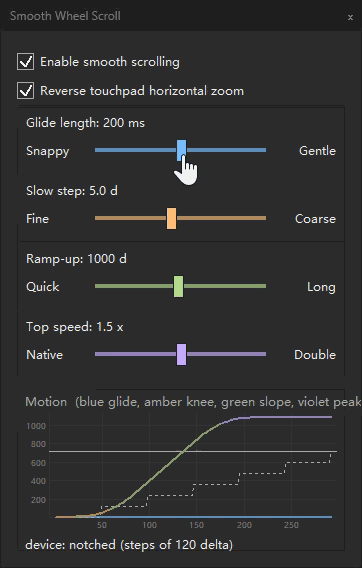

# Smooth Wheel Scroll for REAPER

[](LICENSE)


一个原生 REAPER 扩展：让普通鼠标滚轮驱动的滚动/缩放变得平滑，**不改变滚轮原本做什么**。

[English](README.en.md)

<p align="center">
  
</p>

REAPER 的滚动/缩放大多已有对应的滚轮动作（动作名含 `(MIDI CC relative/mousewheel)`），
这些动作本身就接受平滑的相对量。本插件截住普通鼠标滚轮的一格，把它转换成一段动画，
再**分小份、按时间交给同一条 REAPER 动作**。

插件不自己移动视图、不修改 REAPER 状态。缩放锚点、滚动范围、步进大小、用户自定义规则，
全部仍由 REAPER 决定。

---

## 会做缓动的

| 表面 | 方式 |
|---|---|
| 主视图（arrange）：滚动 + 缩放 | REAPER 自己的动作 |
| 主视图两条滚动条 | 竖直条滚动；`Alt`+滚轮竖直缩放。水平条 `Alt`+滚轮水平缩放（不带 `Alt` 的翻页式快移不接管） |
| MIDI 编辑器：滚动 + 缩放 | MIDI 编辑器自己的 section 动作 |
| 轨道面板（TCP） | 遵从鼠标修饰键：默认 `Scroll TCP` → 竖直滚动；`Adjust vertical zoom` → 竖直缩放 |
| MIDI 编辑器琴键 | 竖直滚动 |
| 调音台（MCP） | 横向滚动 |
| 名字带 `mousewheel` 的动作 | 按**动作名**匹配，因此自定义或重新绑定的快捷键同样生效 |

滚动条按几何识别；轨道面板与调音台按**鼠标修饰键**（`Scroll TCP` / `Scroll MCP`）判断。
把那些组合改成别的（例如 `Passthrough`），插件就放行。

## 不做缓动的

* **参数类滚轮。** 推子、旋钮、速度、发送量、MIDI 音符力度、下拉框等一律原样透传，仍一格一格精确改值。
* **列表控件。** 整行移动，原生响应已是瞬时，加缓动只会增加延迟。
* **触控板、触摸、高分辨率/无级滚轮、触控笔。** 只处理普通有格鼠标滚轮（整倍数 `WHEEL_DELTA`、非触摸注入）。

---

## 安装

Windows x64，REAPER 7。

1. 从 [Releases](../../releases) 下载 `reaper_smoothwheelscroll-x64.dll`。
2. 放进 `UserPlugins`：便携版 `<REAPER>/UserPlugins/`，普通安装 `%APPDATA%\REAPER\UserPlugins\`。
3. 重启 REAPER。

加载后，扩展列表与启动日志中显示为 `Smooth Wheel Scroll 1.7.0`。

### 设置面板

两种打开方式：

1. **Extensions 菜单** → `SmoothScroll...`
2. **Actions 窗口**搜 `Smooth Wheel Scroll`，用 `Smooth Wheel Scroll: settings...`；可绑定快捷键，再按一次关闭。

面板包含缓动总开关、4 个滑杆，以及滑杆下方的**运动轨迹图**。改动即时生效、自动保存。

* **Glide length** — 一格动画的时长（100–300 ms，默认 **200**）。
* **Slow step** — 慢轮一格走多少 delta（1–10，默认 **5**）。
* **Ramp-up** — 转多少 delta 才涨满到整格（60–2000，默认 **1000**）。
* **Top speed** — 最快时能冲到自身速度的几倍（1.0–2.0，默认 **1.5**）。
* **运动轨迹图**：脚本化滚动跑一遍，画「滚轮自己的整步路径」（灰虚线）与「本插件给的平滑路径」
  （按滑杆分段上色），并让**一颗球沿路径跑**。**收到一个滚轮消息就发一颗球**（最多 6 颗同时在飞）。
  关掉总开关时球也跑，走的是整步（方块）那条 —— 一眼看出开关在做什么。
  四个参数**各占一个视觉通道**：Glide 管时间轴、Slow step 管膝点高度、Ramp-up 管坡度、
  Top speed 管纵轴缩放（原生参考线在 `1/Top` 处，`Top=1.0` 时顶线正好压在它上面）。
  刻度按数值取，拉 Glide / Top 时**跟着缩放**。
* 面板跟随 REAPER 的浅色/深色：标题栏、面板底色、文字、滚动条都会随之切换。
* 关掉总开关即完全放行，滚轮回到 REAPER 原生行为。

<p align="center">
  
  &nbsp;&nbsp;
  
</p>
<p align="center">
  <sub>深色主题（动图：拖动滑杆，运动图与刻度实时重塑）&nbsp;·&nbsp;浅色主题</sub>
</p>

### 卸载

删掉 DLL，重启 REAPER。除面板参数外不写任何配置。

---

## 从源码构建

一个翻译单元加几个头文件，用 C++17 编译器对着仓库内的 REAPER SDK（`third_party/`）编译。
参考构建使用便携版 MinGW-w64。

```sh
./build.sh        # release DLL -> build/reaper_smoothwheelscroll-x64.dll
./deploy.sh       # 可选：复制进 REAPER 的 UserPlugins
```

构建参数：

| 参数 | 作用 |
|---|---|
| *（无）* | 含设置面板（默认） |
| `--no-settings-ui` | 不编译设置面板 |
| `--debug-log` | 附加诊断日志（`%TEMP%\SmoothWheelScroll.log`） |

回归门（脱离 REAPER 运行）：

```sh
./test/check_anim3.sh          # 窗口模型：等分、总量精确、与帧率无关、重叠相加
./test/check_conservation.sh   # 拿多少给多少（精确）
./test/check_travel.sh         # 每格行程来自速度预算，且与设备无关
./test/check_device.sh         # 有格 / 无级 / 触控板 的区分
./test/check_routes.sh         # 投递路由与冻结基线逐条对比
./test/check_classify.sh       # 分类规则改动前后对比（只允许 one page）
./test/check_filter.sh         # 过滤器规则（各轴的投递粒度）
```

---

## 代码结构

| 文件 | 内容 |
|---|---|
| `src/anim3_core.h` | 3.0 模型：窗口 / 付出形状（纯数学，不依赖 REAPER / Windows） |
| `src/anim161_core.h` | 1.6.1 曲线模型（竖直缩放用，与 1.6.1 逐字节相同） |
| `src/model.h` | 模型接缝：唯一对外的模型入口 |
| `src/routing.h` | 投递路由：哪条动作、什么粒度 |
| `src/device.h` | 设备分类（有格 / 无级 / 触控板） |
| `src/smooth_wheel_scroll.cpp` | REAPER 扩展：分类、喂入、投递、设置面板 |
| `test/` | 回归门 |
| `versions/<ver>/` | 各版本冻结快照 |
| `third_party/` | REAPER 扩展 SDK |

---

## 限制

* 仅 Windows x64；macOS / Linux 需要各自的窗口钩子实现。
* 仅普通有格鼠标滚轮。设备本身已带惯性的情况下可能感到双重缓动。

---

## 许可证

MIT —— 见 [LICENSE](LICENSE)。`third_party/` 内的 REAPER 扩展 SDK 适用其自带许可。
